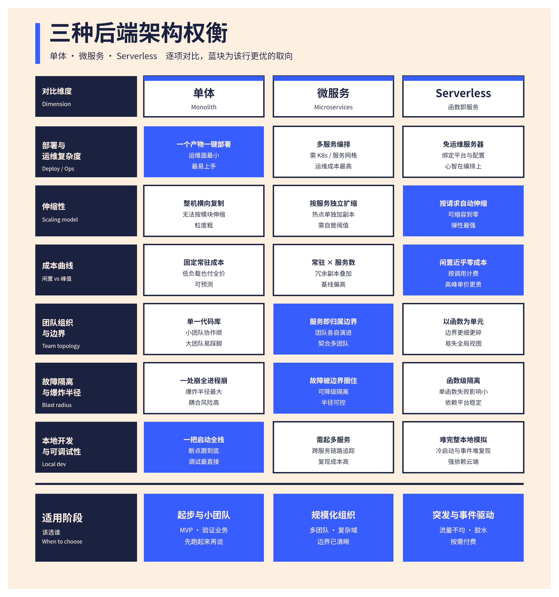
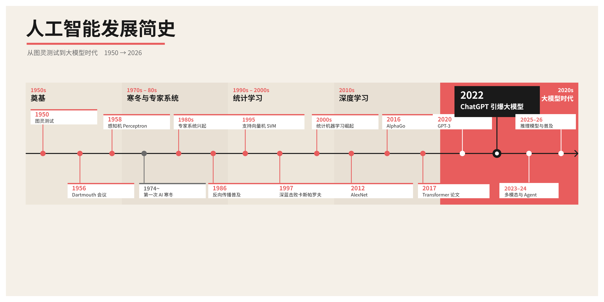
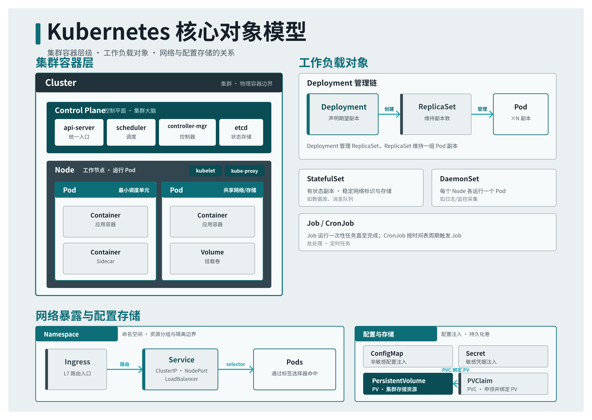
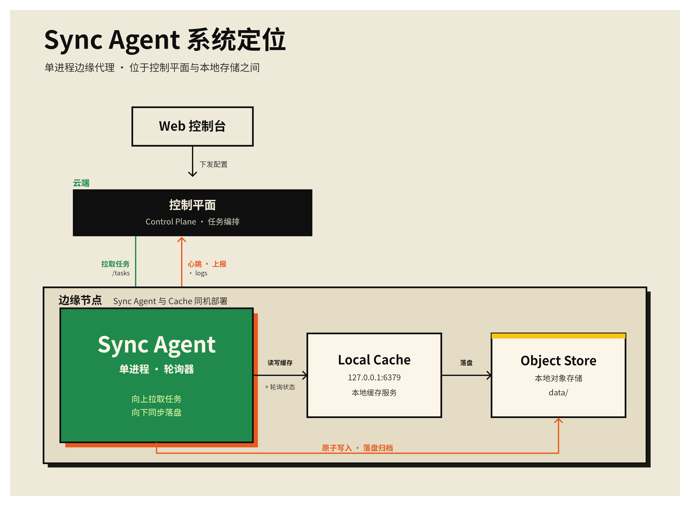
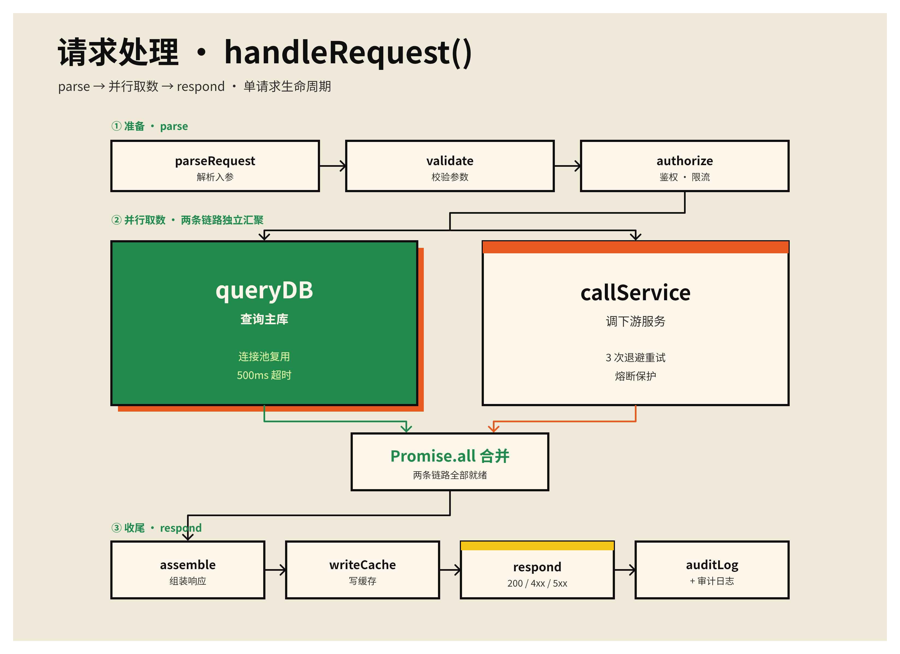
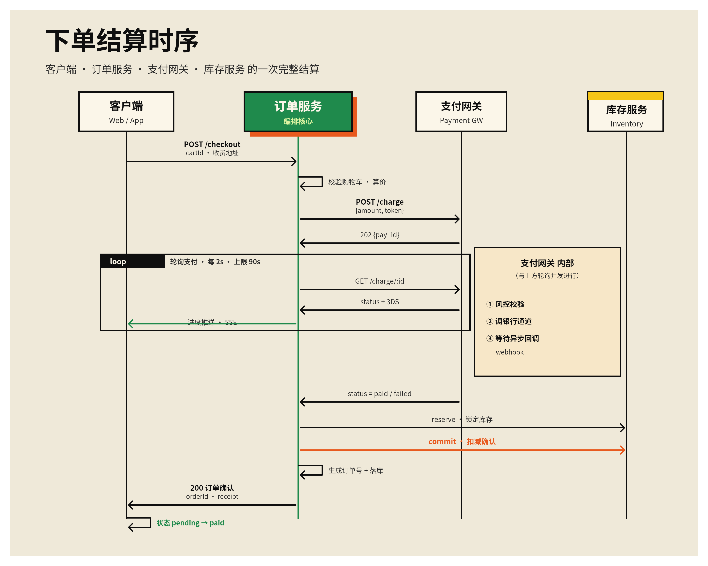

# feishu-whiteboard-pro

一个用于打造真正"经过设计"的飞书 / Lark（飞书）白板的 Claude Code / agent **skill**——不只是配色
好看，而是讲究构图：清晰的视觉焦点、真实的层次、刻意的留白。它产出的是飞书文档里一块**可编辑**的真实白板，
而不是一张截图。

它构建于 [beautiful-feishu-whiteboard](https://github.com/zarazhangrui/beautiful-feishu-whiteboard)
（沿用其配色板与 SVG 白板介质的硬性规则）之上，补上了原项目缺失的那一层：**如何构图，以及如何判断结果到底好不好。**

## 相比一个"配色板库"它多了什么

介质本身被刻意限制——单一字体、只有原生矩形 / 圆 / 连接线，没有渐变、滤镜、透明度、动效。所以这里的"好看"
指的是构图、层次、节奏、配色克制与留白。这个 skill 把两个原本靠临场发挥的软步骤变成了**关卡（gate）**：

```
理解内容
   │
   ├─▶ 关卡 1 · 设计简报      原型 + 焦点 + 配色策略 + 字号角色 + 反套路检查
   ▼
对照骨架构图               原型坐标 + 固定字号阶梯 + 8px 间距网格
   │
   ▼
渲染前预测缺陷（fit-check）  确定性：标签过宽 / 挤占间距 / 出血，在渲染前就抓出来
   │
   ▼
渲染 → 修正确性             溢出 / 重叠 / 裁切 / 手画箭头
   │
   ▼
关卡 2 · 设计评审           按层次 / 平衡 / 密度 / 对比 / 对齐五轴打分；要交付的板子上独立评审；修最弱项；重复
   ▼
写入飞书 → 看实时效果 → 交付
```

- **`fit-check`**（[scripts/fit-check.mjs](scripts/fit-check.mjs)）—— 估算每个标签的宽度（中文 ≈ 1em，
  拉丁字符 ≈ 0.6em），在渲染**之前**就标出溢出 / 挤占间距 / 出血。确定性，不耗模型。
- **独立评审** —— 对要交付的板子，由一个独立评审者对渲染结果做对抗式打分，把"只靠颜色撑起来"的假焦点和
  失衡的构图揪出来，而不是自我合理化。

## 示例

七张标杆样板，每张都过了双关卡（fit-check 干净、设计评审过关）并在真实飞书白板上渲染过。它们覆盖不同原型
与配色板——其中一张还用的是**现场生成**的配色——但都出自同一条流水线，所以构图与配色是解耦的。把对应的
`.svg`（在 [`examples/`](examples/) 里）当作起手骨架打开，坐标都已经是评审过关的。

**四张复杂板子，四种不同配色：**

| | |
|:--:|:--:|
| <br>**放射式系统图** · Riso Brut | <br>**对比矩阵** · Riptide Cobalt |
| <br>**时间线** · Coral | <br>**层级图** · *现场生成*配色 |

**三张基础板子，共用一套配色（Riso Brut）：**

| | | |
|:--:|:--:|:--:|
| <br>**系统图** | <br>**流程 + 分叉 / 汇合** | <br>**泳道时序** |

## 配色 —— 精选锚点，或现场生成

这里的配色是**一套设计系统，不是色卡清单**：每套配色都给颜色分配角色（画布、墨色、强调色、面板）并附用途
说明和投放剂量，让 agent 知道每种颜色**该怎么用**，而不只是有哪些 hex。

- **一组精挑的锚点。** [`CATALOG.md`](CATALOG.md) 列出从克制到大胆的锚点配色；按气质和正式度挑一套。
  每套就是一个 `templates/<slug>/design.md`，并且是唯一真相源——目录表由它们经 `scripts/build-catalog.mjs`
  生成。
- **没有合适的就现场生成。** 如果没有锚点契合简报，skill 会按 [`templates/GENERATE.md`](templates/GENERATE.md)
  生成一套——OKLCH 明暗推导、带色偏的中性色、角色剂量，以及介质自身的约束（画布绝不用纯白、墨色绝不用
  `#000`、纯平 / 无透明度）。它产出的 frontmatter 形态和锚点**完全一致**，所以照样能换肤、也能存成新模板。
  上面那张层级图用的就是现场生成的 “Steel Infra” 配色。
- **随时换肤。** 换配色只改颜色、不动构图。

## 前置条件

- **Node 20+**
- **[`lark-cli`](https://www.npmjs.com/package/@larksuite/cli)** 已安装并完成认证：
  `npm install -g @larksuite/cli`，然后 `lark-cli config init`（扫码）和 `lark-cli auth login`
- **`@larksuite/whiteboard-cli`** —— 通过 `npx` 使用，自动下载，无需安装
- 一个**飞书 / Lark 账号**（板子写进你自己的租户）

运行 [`scripts/preflight.sh`](scripts/preflight.sh) 可一次性检查以上全部。

## 安装

用 [`skills`](https://github.com/vercel-labs/skills) CLI —— 它会识别你的 agent（Claude Code、Cursor、
Codex…）并把 skill 软链到正确的目录：

```bash
# 全局（用户级），所有项目可用：
npx skills add -g LcpMarvel/feishu-whiteboard-pro

# …或项目级，只装进当前仓库：
npx skills add LcpMarvel/feishu-whiteboard-pro
```

不安装、只试一次：`npx skills use LcpMarvel/feishu-whiteboard-pro`。

<details>
<summary>手动安装（clone + 软链）</summary>

```bash
git clone https://github.com/LcpMarvel/feishu-whiteboard-pro.git

# Claude Code（用户级 skills）：
ln -s "$(pwd)/feishu-whiteboard-pro" ~/.claude/skills/feishu-whiteboard-pro
```

</details>

重启会话；之后只要你让它创建或打磨飞书白板、信息图、图表或可视化讲解，skill 就会触发。

## 仓库结构

| 路径 | 作用 |
|---|---|
| [`SKILL.md`](SKILL.md) | 门控流水线与编排 |
| [`COMPOSITION.md`](COMPOSITION.md) | 原型库（坐标骨架）、字号阶梯、间距网格、反套路清单——核心 |
| [`CRITIQUE.md`](CRITIQUE.md) | 渲染后设计评分准则（五轴）+ 独立评审说明 |
| [`RULES.md`](RULES.md) | 飞书 SVG 白板介质的硬性限制，实测验证 |
| [`templates/`](templates/) | 一组精选配色板（每套一个 `design.md`）——唯一真相源 |
| [`CATALOG.md`](CATALOG.md) | 选色表，由 `templates/` 经 `scripts/build-catalog.mjs` **生成** |
| [`templates/GENERATE.md`](templates/GENERATE.md) | 没有锚点契合时，如何生成一套（同 frontmatter 形态）新配色 |
| [`examples/`](examples/) | 七张按原型分类的标杆样板（可编辑 `.svg` + 渲染图） |
| [`scripts/`](scripts/) | `fit-check.mjs`（渲染前预测）、`build-catalog.mjs`（重生成 CATALOG）、`preflight.sh` |

## 致谢与许可

MIT。**精选并蒸馏过的一部分配色**与介质规则改编自
**[beautiful-feishu-whiteboard](https://github.com/zarazhangrui/beautiful-feishu-whiteboard)**，作者
**Zara Zhang（[@zarazhangrui](https://github.com/zarazhangrui)）** —— © Zara Zhang，MIT。构图、评审、
fit-check、门控流水线与配色生成层为原创新增。设计判断的思路受 **impeccable / frontend-design** skill 启发
（未拷贝代码）。详见 [`LICENSE`](LICENSE)。
